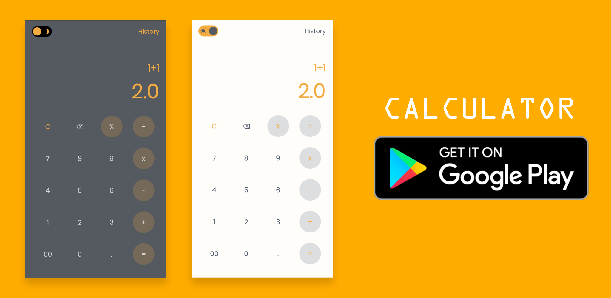
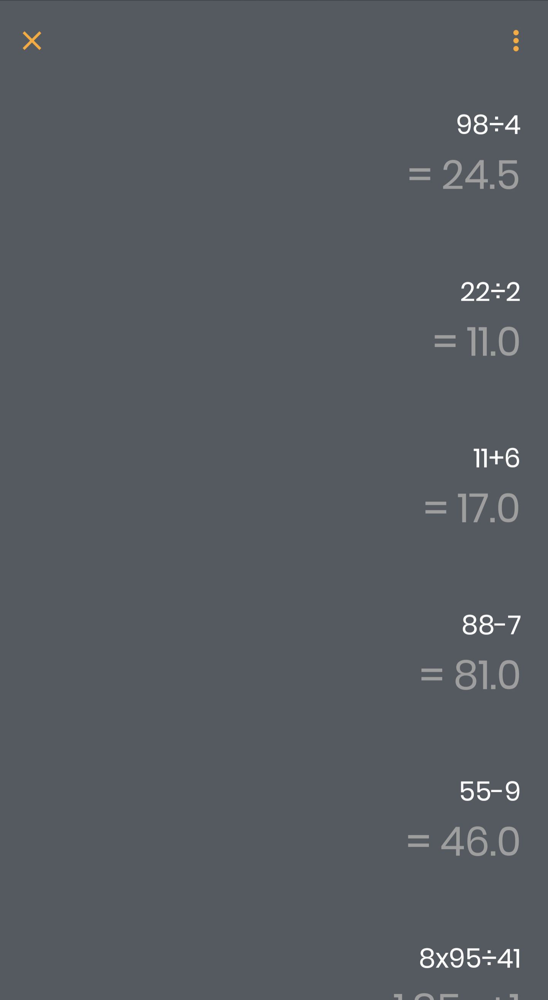
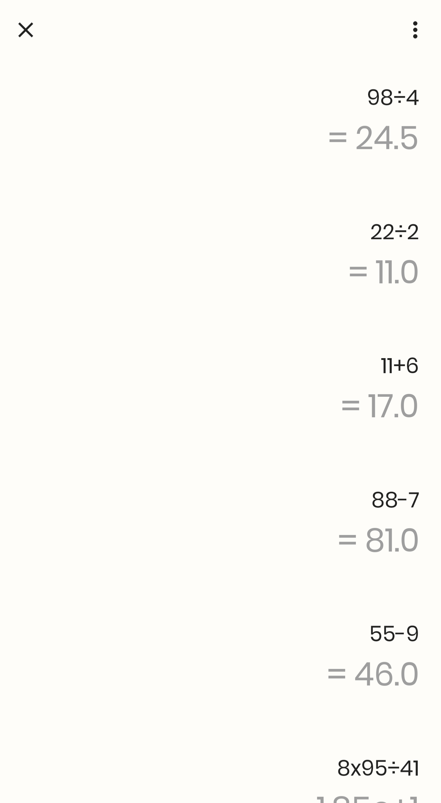
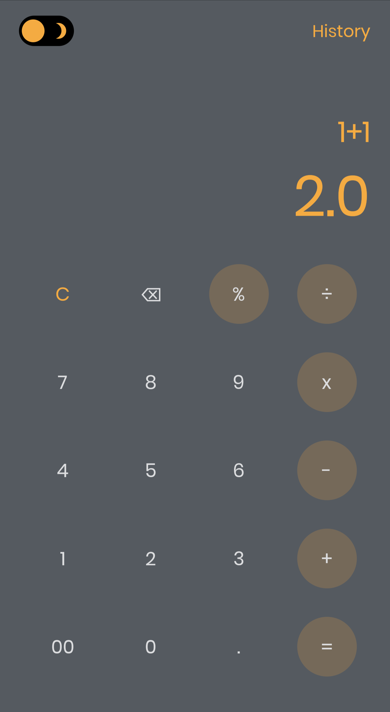
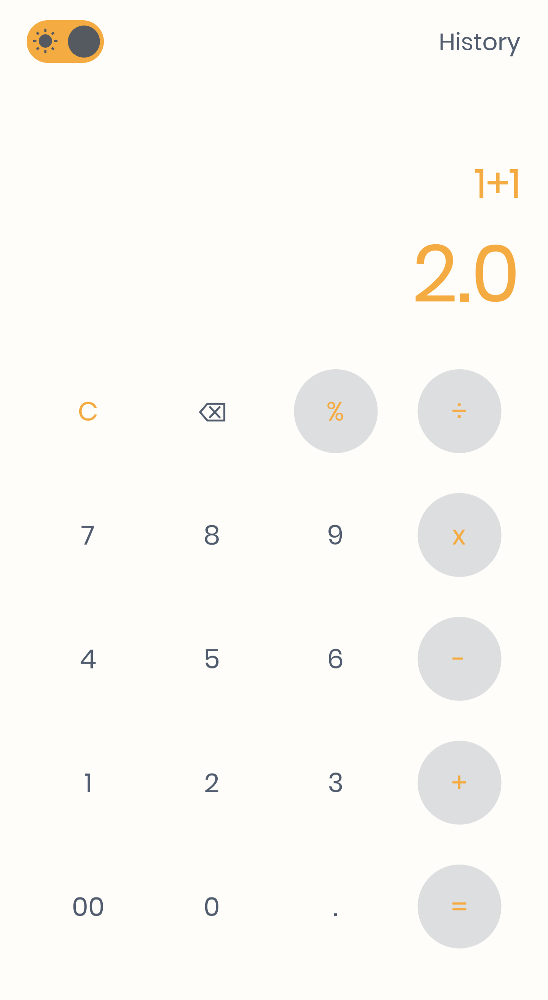

# Calculator

A simple calculator built in flutter.

Star this repo if you like what you see.

## 📸 Screenshots

 

 

 

## Author(s)
**Emmanuel Fache**

## Download App

## Getting Started

**Note**: Make sure your Flutter environment is setup.
#### Installation

In the command terminal, run the following commands:

    $ git clone https://github.com/emrade/flutter-calculator.git calculator
    $ cd calculator/
    $ flutter packages get
    $ flutter run

##### Check out Flutter’s online [documentation](http://flutter.io/) for help getting started with your Flutter project.
